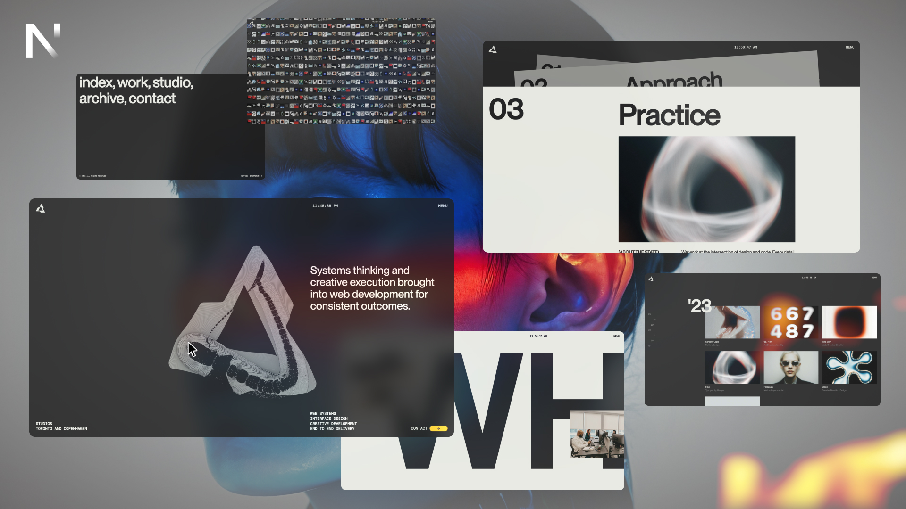

# Wu-Wei - Modern Portfolio Website Template



A sophisticated, minimalist portfolio website template built with Next.js, featuring smooth animations and modern design aesthetics.

## ✨ Features

- **Modern Design**: Clean, minimalist aesthetic with attention to detail
- **Smooth Animations**: Powered by GSAP with custom transitions
- **Responsive**: Fully responsive design that works on all devices
- **Performance Optimized**: Built with Next.js for optimal performance
- **View Transitions**: Smooth page transitions using next-view-transitions
- **Interactive Menu**: Animated navigation with time display
- **Scroll Effects**: Beautiful scroll-triggered animations

## 🚀 Tech Stack

- **Framework**: Next.js 15.4.6
- **Styling**: Custom CSS with modern design principles
- **Animations**: GSAP (GreenSock) with ScrollTrigger
- **Smooth Scrolling**: Lenis for buttery smooth scroll experience
- **Icons**: React Icons
- **View Transitions**: next-view-transitions for seamless navigation

## 📦 Installation

1. Clone the repository:
```bash
git clone https://github.com/Alexey9911/website-template-02.git
```

2. Navigate to the project directory:
```bash
cd website-template-02
```

3. Install dependencies:
```bash
npm install
```

4. Run the development server:
```bash
npm run dev
```

5. Open [http://localhost:3000](http://localhost:3000) in your browser.

## 🔧 Available Scripts

- `npm run dev` - Start development server
- `npm run build` - Build for production
- `npm run start` - Start production server
- `npm run lint` - Run ESLint

## 📁 Project Structure

```
wu-wei/
├── public/
│   ├── images/
│   └── image1.jpg
├── src/
│   ├── app/
│   ├── components/
│   │   ├── Footer/
│   │   └── Menu/
│   └── styles/
├── package.json
└── README.md
```

## 🎨 Customization

This template is designed to be easily customizable:

- **Colors**: Update the CSS custom properties in your stylesheets
- **Content**: Modify the components to match your content needs
- **Animations**: Adjust GSAP timelines and effects
- **Layout**: Responsive grid system that adapts to your content

## 📱 Pages

- **Home** (`/`) - Landing page with hero section
- **Work** (`/work`) - Portfolio showcase
- **Studio** (`/studio`) - About/services page
- **Archive** (`/archive`) - Project archive
- **Contact** (`/contact`) - Contact information

## 🌐 Deployment

This project is optimized for deployment on Vercel. Simply connect your GitHub repository to Vercel for automatic deployments.

[](https://vercel.com/new/clone?repository-url=https://github.com/Alexey9911/website-template-02)

## 📄 License

This project is open source and available under the [MIT License](LICENSE).

## 🤝 Contributing

Contributions, issues, and feature requests are welcome! Feel free to check the [issues page](https://github.com/Alexey9911/website-template-02/issues).

## ⭐ Show your support

Give a ⭐️ if this project helped you!

---

*Built with ❤️ using Next.js and GSAP*
